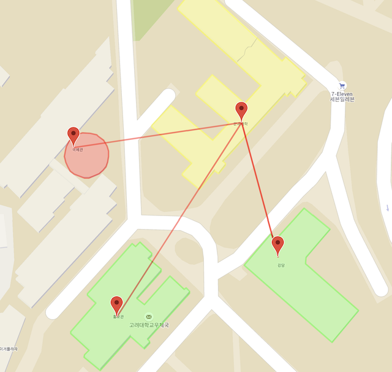

고려대학교 코로나-19 확진자 정보를 빠르고 정확하게 한 눈에 알아볼 수 있도록 하는 것을 목표로 하는 웹 서비스 프로젝트입니다.

# What is KUVID?

KUVID (**K**orea **U**niversity CO**VI**D-19 **D**ashboard)는 고려대학교 내 확진자 현황과 동선에 대한 정보를 확인하기 어려운 고려대학교 학생들을 위한 웹 사이트입니다.
카카오톡, 페이스북으로만 공지되는 교내 확진자 정보를 한눈에 확인하고, 이전 확진자에 대한 정보를 빠르게 찾을 수 있도록 서비스를 제공하고 있습니다.

교내 확진자 정보 외에도 체크리스트를 통한 코로나-19 의심 증상 확인, 학교 주변 보건소 위치 및 정보 확인 등 학생 및 교직원들이 빠르게 코로나-19에 대처할 수 있는 다양한 정보들을 실시간으로 업데이트하여 제공하고 있습니다.

# Overview

메인 페이지는 교내 확진자 정보의 현황을 한 눈에 알아볼 수 있는 차트와 최근 교내 확진자 및 단과대학 건물 방역 정보를 확인할 수 있는 공지사항이 있습니다.
이는 교내 코로나-19 대응 부서 관리자가 데이터베이스를 업데이트할 경우 실시간 정보가 반영될 수 있도록 할 예정입니다.
매일 보건복지부 및 질병관리본부에서 선전하는 코로나-19 관련 주의 및 예방 정보를 공유하기 위한 별도의 배너가 있습니다.
또한, 우리가 자체 제작한 오늘의 방역 수칙을 매일 변경하고 배너에 표기하며 일상 생활에서 지키기 쉬운 방역 수칙을 학생 및 교직원이 숙지할 수 있도록 보여주고 있습니다.

핵심 기능은 고려대학교 및 주변 상권에 대한 확진자 동선 확인입니다.
Google Maps API를 사용하여 지도에 교내 확진자의 동선을 표기하고 있고, 이후 계획으로는 교내 CCTV를 통한 역학조사를 기반으로 방문한 건물에 대한 동선 뿐만 아니라 지하철역, 교내 도로 등으로 범위를 확대하여 더욱 자세한 동선을 보여줄 수 있도록 개발할 계획입니다.

# Why KUVID?

현재 코로나-19 확진자 현황 및 동선을 확인할 수 있도록 서비스하는 웹 사이트는 [CoronaMap](https://coronamap.site), [Goodbye Corona](https://corona-19.kr) 등이 있습니다.
하지만, 이들은 모두 국내 코로나-19 확진자를 위주로 정보를 제공하고 있기 때문에 자세한 정보가 아닌 지역이나 규모가 큰 건물 별로 코로나-19 확진자 동선을 간략하게 제공하고 있습니다.


학교 및 주변 상권에서 오래 머무르며 일정 범위 내에서 복잡한 동선을 가지고 있는 학생과 교직원에게는 이와 같은 불필요한 정보보다는 학교와 주변 상권에 한정된 자세한 확진자 동선에 대한 정보가 필요할 것입니다.

우리는 이러한 상황에 맞추어 학교 및 주변 상권에 대한 자세한 확진자 동선 및 학교 내 단과대학 건물 방역 정보와 같은 필수적인 정보들을 알아보기 쉬운 형태로 제공하는 것을 목표로 하고 있습니다.



# Getting Started

KUVID를 사용하기 위해 [소스를 다운로드하여 빌드](#build-from-source)합니다.
터미널을 사용 가능한 모든 macOS/Windows/Unix/Linux 시스템에서 KUVID를 빌드할 수 있습니다.

## Build from Source
### Install Node.js

[Install Node.js](https://nodejs.org/en/download/)에서 KUVID 실행에 필요한 `node.js 14.17.1 LTS`를 설치합니다.

> NOTICE: Node.js last feature current version을 설치할 경우 문제가 발생할 수 있습니다.

`node.js`, `npm`이 정상적으로 설치되었는지 확인합니다.

```bash
node -v
npm -v
```

### Download Source

Repository에서 KUVID 소스를 다운로드 받습니다.

```bash
git clone git@github.com:jsonbsd/kuvid.git
cd kuvid
```

### Install Dependent Libraries

KUVID 실행에 필요한 필수 라이브러리를 설치합니다.

```bash
npm install
```

### Build and Run

KUVID 소스를 빌드하고 실행합니다.

```bash
npm run start
```

### Connet to KUVID

Chrome, Safari 등의 웹 브라우저에서 다음 URL을 입력하여 KUVID에 접속합니다.

```
http://localhost:3000
```

# Design

KUVID의 전체적인 아키텍처와 각 탭에서 구현된 기능에 관한 설명은 [KUVID Wiki](https://github.com/jsonbsd/kuvid/wiki)에서 확인할 수 있습니다.
